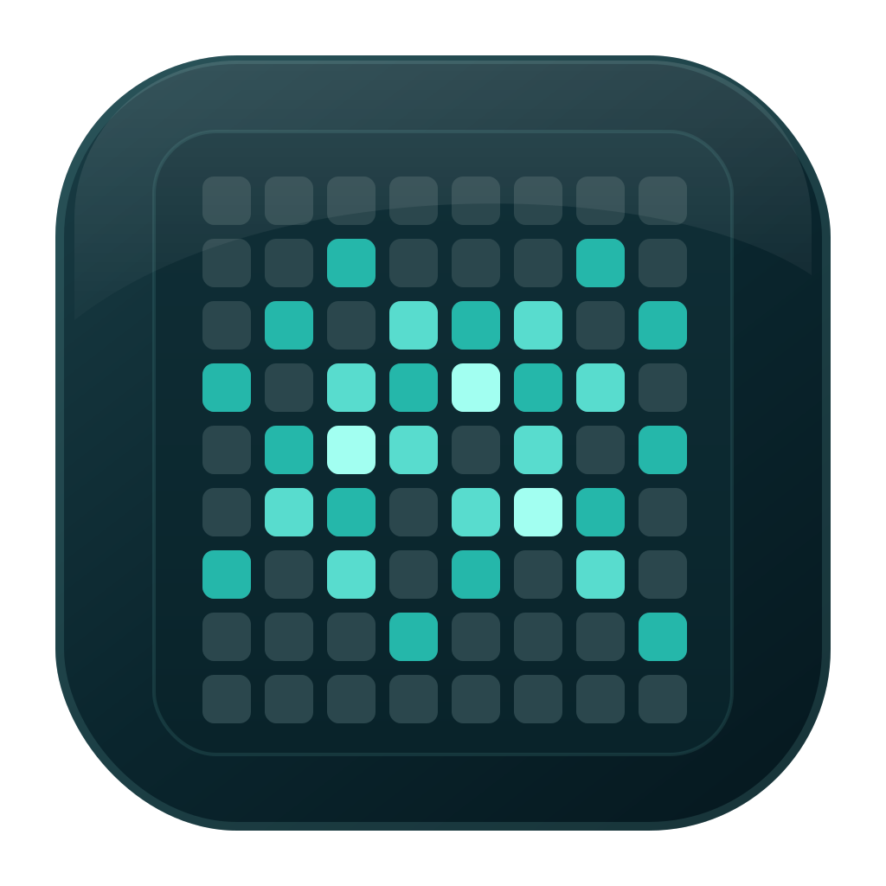
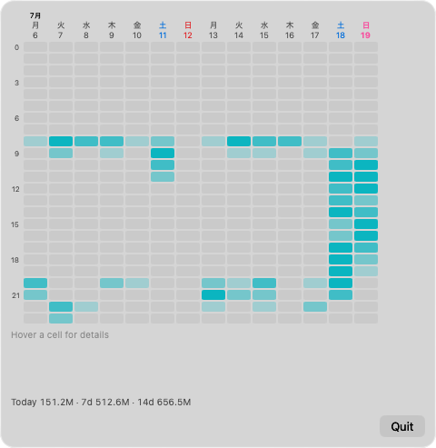
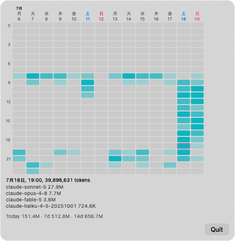
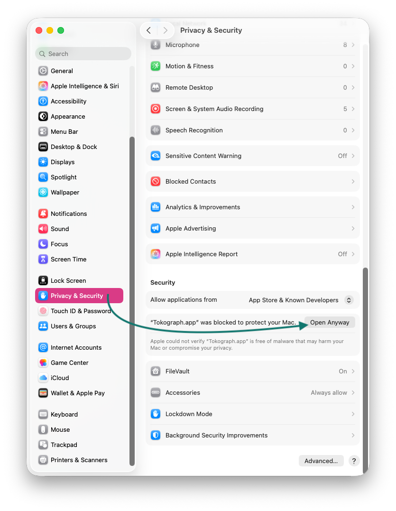
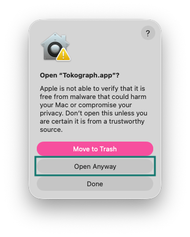

# Tokograph

  

  

  
  
  
  

**Unofficial — not affiliated with Anthropic.**

A macOS menu-bar app that shows which day, at which hour, you spent how many
tokens in Claude Code — as a day×hour heatmap. Read-only, fully local, no network.

  
   
  14-day token usage overview

  
   
  Hover a cell to see the date, hour, token count, and per-model usage.

## How it works

Tokograph reads Claude Code's local session transcripts
(`~/.claude/projects/**/*.jsonl`), deduplicates streamed/duplicated entries,
and renders a pageable 14-day window as a 14-column × 24-row heatmap. The
arrow controls move the window by seven days through the history that Claude
Code still retains.

- **Read-only.** Never writes to, or transmits, anything.
- **Local.** No network access, no analytics, no crash reporting.
- **Honest.** Skipped or unrecognized log entries are counted and shown, never hidden.
- The jsonl format is Anthropic's undocumented internal format; a Claude Code
  update may break parsing until Tokograph is updated.

## Install

### Download

Download `Tokograph.zip` from
[Releases](https://github.com/moyashimegane/tokograph/releases), unzip, and
move `Tokograph.app` to `/Applications`. Release zips are built by GitHub
Actions from the tagged commit.

The app is unsigned and not notarized, so macOS blocks its first launch.
Only override this warning for a copy downloaded from this repository's
[Releases](https://github.com/moyashimegane/tokograph/releases) page. Do not
disable Gatekeeper globally.

SHA-256 checksums in release notes detect corruption only — they do not prove
origin. Releases carry GitHub artifact attestation — verify provenance with:

    gh attestation verify Tokograph.zip --repo moyashimegane/tokograph

#### First launch

These screenshots show macOS 26. Labels and layout may differ on earlier
versions.

1. Try to open `Tokograph.app` once. When macOS blocks it, close the warning.
2. Open System Settings → Privacy & Security, scroll to Security, then click
   **Open Anyway**.

  

3. In the confirmation dialog, click **Open Anyway** again.

  

4. Authenticate with your Mac login password or Touch ID. macOS saves the
   exception, so later launches open normally.

If the controls look different on your macOS version, follow
[Apple's official instructions](https://support.apple.com/guide/mac-help/mh40617/mac).

### Build from source

Requires Xcode command-line tools on macOS 13+:

    git clone https://github.com/moyashimegane/tokograph
    cd tokograph && ./scripts/build-app.sh
    open dist/Tokograph.app

## Custom log location

If you use `CLAUDE_CONFIG_DIR`, note that apps launched from Finder do not see
shell environment variables. Set the path explicitly:

    defaults write io.github.moyashimegane.tokograph configRoot /path/to/your/.claude

An invalid override shows a config error rather than silently falling back.

## Compatibility

Deployment target macOS 13+. Verified on macOS 26 only; earlier versions are
best-effort/untested. Log format verified against Claude Code 2.1.209.

## License

MIT
